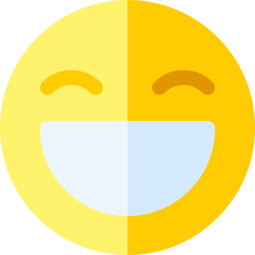
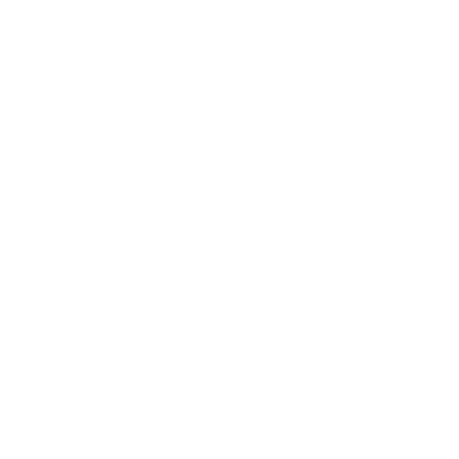

<h2 align="center">¡Hola terrícola! </h2>

Mi nombre es <strong>Miriam</strong>  Estoy encantada de conocerte y, de antemano, ¡gracias por pasarte por aquí! 

Soy  <em><strong>desarrolladora Front-End Jr</strong></em>  gracias a  y su curso intensivo de programación web.

Actualmente sigo formándome  para dar lo mejor de mí en este inmenso y apasionante universo tecnológico  pero, por el momento, te comparto lo que he aprendido:

Y, si te interesa contactarme , pincha por aquí:

 

¡Gracias por tu tiempo!

  

